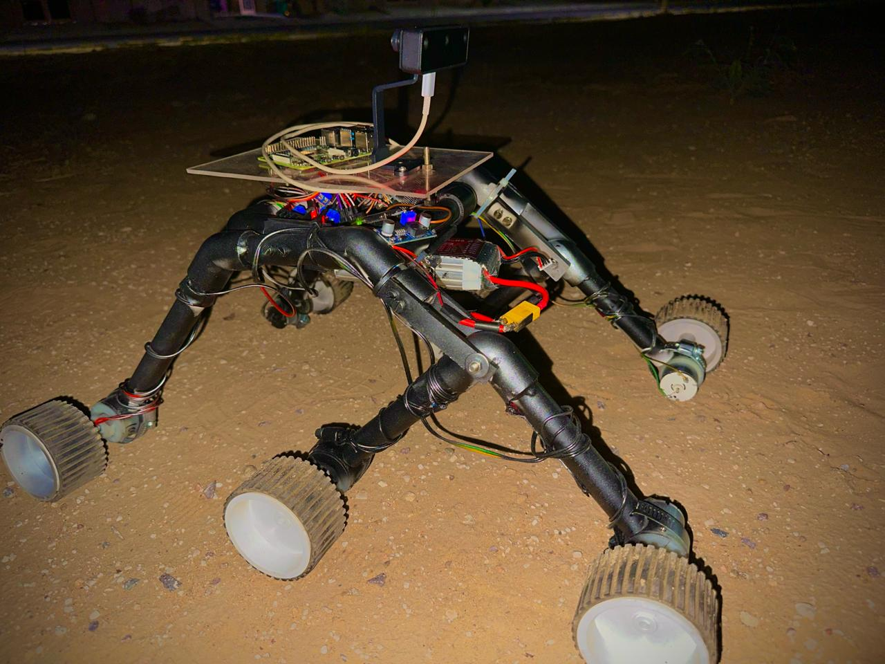
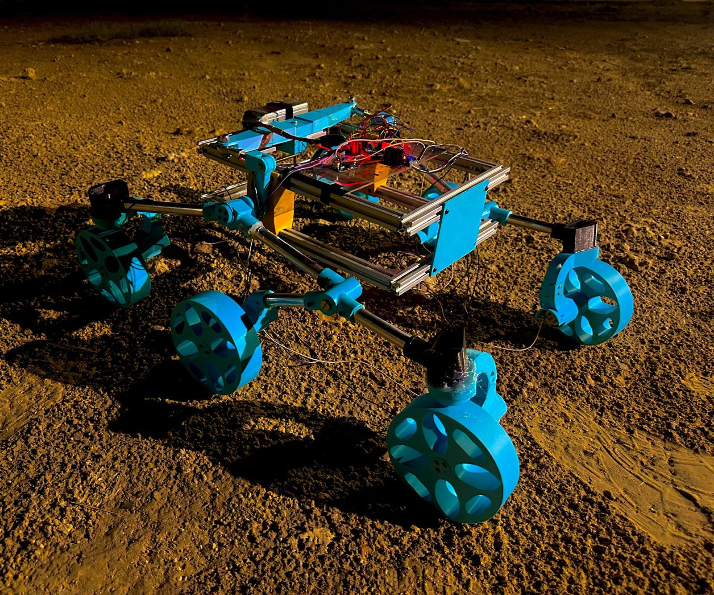

# ISRO-IRoC-U-2024

## Overview

This repository contains the code and documentation for our team's participation in the **ISRO IRoC Rover Challenge 2024**. We are a group of enthusiastic engineers from **IIT Jodhpur**, and our project involved creating a highly functional rover with advanced object detection and path planning capabilities. 

## Project Description

Our project involved engineering a rover prototype capable of navigating complex environments autonomously. Key features include:

- **Object Detection**: Leveraging YOLOv8, we fine-tuned the model for custom object detection and implemented Expandable YOLO for depth detection up to 3 meters.
- **Path Planning**: We integrated the object and depth detection systems with a modified Theta* path planning algorithm, ensuring efficient navigation even in challenging terrains.
- **Real-time Performance**: Our system achieves an inference time of less than 300ms, enabling real-time decision-making.

## Technologies Used

- **Programming Languages**: Python, C++
- **Frameworks and Libraries**: ROS2, OpenCV, Pytorch, Gradio
- **Hardware**: Raspberry Pi, Camera Modules, Sensors
- **Software**: Raspbian OS, SolidWorks
- **Machine Learning**: YOLOv8, Expandable YOLO

## Achievements

- **Nationwide Ranking**: Top 20 in the ISRO IRoC Rover Challenge 2024.
- **Real-Time Object Detection**: Achieved sub-300ms inference time.
- **Enhanced Path Planning**: Modified Theta* algorithm for efficient pathfinding.

## Prototypes

  
  

## Demonstration

**Prototype 1**.
  
])

**Prototype 2 (Click on image to play the video)**.
  
 

